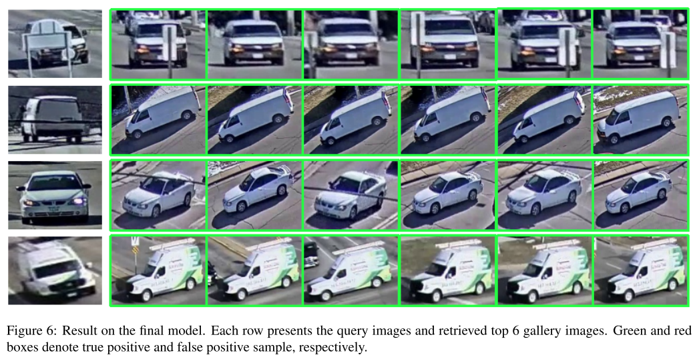
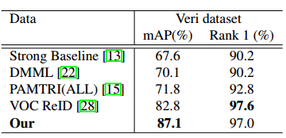

# A STRONG BASELINE FOR VEHICLE RE-IDENTIFICATION
**Paper is accepted to the IEEE Conference on Computer Vision and Pattern Recognition Workshop(CVPRW) 2021**




This repo is the official implementation for paper [**A Strong Baseline For Vehicle Re-Identification**](./images/paper.pdf) in [Track 2, 2021 AI CITY CHALLENGE](https://www.aicitychallenge.org/).


## I.INTRODUCTION
Our proposed method sheds light on three main factors that contribute most to the performance, including:
+ Minizing the gap between real and synthetic data
+ Network modification by stacking multi heads with attention mechanism to backbone
+ Adaptive loss weight adjustment.

Our method achieves 61.34% mAP on the private CityFlow testset without using external dataset or pseudo labeling, and outperforms all previous works at 87.1% mAP on the [Veri](https://vehiclereid.github.io/VeRi/) benchmark.

## II. INSTALLATION
1. pytorch>=1.2.0
2. yacs
3. [apex](https://github.com/NVIDIA/apex) (optional for FP16 training, if you don't have apex installed, please turn-off FP16 training by setting SOLVER.FP16=False)
````
$ git clone https://github.com/NVIDIA/apex
$ cd apex
$ pip install -v --no-cache-dir --global-option="--cpp_ext" --global-option="--cuda_ext" ./
````
4. python>=3.7
5. cv2
## III. REPRODUCE THE RESULT ON AICITY 2020 CHALLENGE
Download the pretrained checkpoint [resnext101_ibn](https://drive.google.com/file/d/197nnkY9fZpiE-96B31V59DB-2rm-ZxbG/view?usp=sharing)

### 1.Train

+ **Vehicle ReID**
```bash
    ./scripts/train.sh
```

+ **Orientation ReID**
```bash
    ./scripts/ReOriID.sh
```

+ **Camera ReID**
```bash
    ./scripts/ReCamID.sh
```

### 2. Test
```bash
    ./scripts/test.sh
```


## IV. PERFORMANCE

### 1. Comparison with state-of-the art methods on VeRi776
+ Download the [checkpoint](https://drive.google.com/file/d/1iOwk054Fs2pbqnOTQ0UJSv7Yhhk7IRun/view?usp=sharing)




